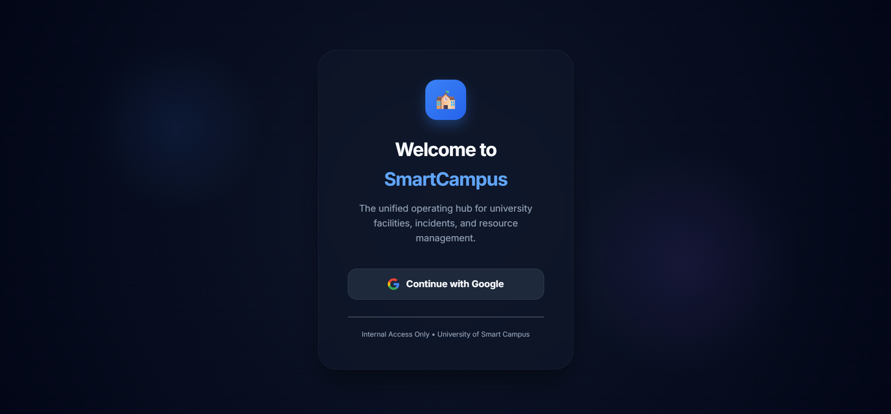
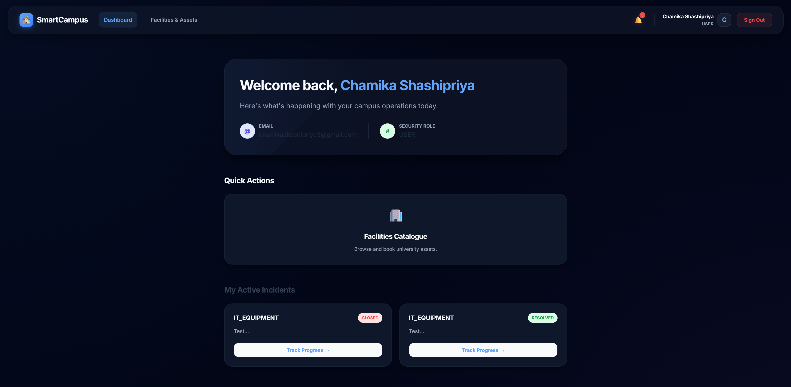

# Smart Campus Operations Hub 🏫

**IT3030 – Programming Applications and Frameworks**  
**Assignment 2026 (Semester 2)**  
**Faculty of Computing – SLIIT**


## 📋 Project Overview

A complete, production-inspired web system for university facility and asset management. This platform modernizes day-to-day campus operations by providing a single integrated platform for **resource booking**, **maintenance tracking**, and **incident handling** with role-based access control and full auditability.

### Business Scenario
A university needs a web platform to:
- Manage facility and asset bookings (rooms, labs, equipment)
- Handle maintenance and incident reports with technician workflow
- Support clear workflows with role-based access
- Provide real-time notifications and audit trails

---

## ✨ Core Features (Modules A–E)

### Module A – Facilities & Assets Catalogue
- **Catalogue Management**: Maintain a comprehensive catalogue of bookable resources
  - Types: Lecture Halls, Labs, Meeting Rooms, Equipment (projectors, cameras, etc.)
  - Metadata: Capacity, location, availability windows, status (`ACTIVE` / `OUT_OF_SERVICE`)
- **Search & Filtering**: Filter by type, capacity, and location with real-time search
- **Status Tracking**: Live visibility of resource availability

### Module B – Booking Management
- **Booking Workflow**: `PENDING` → `APPROVED`/`REJECTED` → `CANCELLED` (optional)
- **Conflict Prevention**: Automatic detection of overlapping time ranges
- **Approval System**: Admin review and approval/rejection with custom reasons
- **User Views**: 
  - Users see only their own bookings
  - Admins see all bookings with filtering capabilities

### Module C – Maintenance & Incident Ticketing
- **Ticket Creation**: Users can report incidents with category, description, and priority
- **Attachments**: Support up to 3 image attachments per ticket (evidence documentation)
- **Ticket Workflow**: `OPEN` → `IN_PROGRESS` → `RESOLVED` → `CLOSED` (Admin may set `REJECTED`)
- **Technician Assignment**: Staff can be assigned to tickets with status updates and resolution notes
- **Comments System**: Multi-user commenting with ownership rules (edit/delete own comments only)

### Module D – Notifications
- **Notification Events**: 
  - Booking approval/rejection
  - Ticket status changes
  - New comments on user's tickets
- **UI Access**: Notification panel in the web interface

### Module E – Authentication & Authorization
- **OAuth 2.0 Login**: Google sign-in integration
- **Role-Based Access Control**:
  - `USER`: Regular students/staff
  - `ADMIN`: Resource and booking management
  - `TECHNICIAN`: Ticket assignment and resolution (optional enhancement)
- **Secured Endpoints**: All endpoints protected by role-based authorization

### ✨ Extra Feature – Personalized PDF Report Generation
- **User-Role-Specific Reports**: Generate professional PDF reports tailored to each user role
  - **Admin Audit Report**: System summary, user count, resources inventory, global incident log
  - **Technician Performance Report**: Assigned tickets, resolution stats, workload analysis
  - **User Activity Report**: Personal booking history, ticket submissions, activity timeline
- **Professional Formatting**: 
  - Branded headers with timestamp
  - Multi-page support with automatic pagination
  - Styled tables with role-specific color schemes
  - Audit metadata (report type, generated by, date/time)
- **Export Capability**: Download as PDF with user-customized data

---

## � Requirements Specification

### Functional Requirements (by Module)

#### **Module A: Facilities & Assets Catalogue**
- Browse all resources with metadata (name, type, capacity, location, status)
- Search resources by name/type
- Filter resources by type, capacity, and location
- View resource image and detailed information
- **Admin Only**: Create, update, delete resources
- **Admin Only**: Manage resource status (ACTIVE / OUT_OF_SERVICE)

#### **Module B: Booking Management**
- Create booking requests with date, time, and purpose
- Automatic conflict detection (prevent overlapping bookings)
- Booking workflow: PENDING → APPROVED/REJECTED → CANCELLED
- **Admin Only**: Approve or reject bookings with optional reason
- Users can view only their own bookings; Admins can view all
- Cancel bookings (users can cancel their own)
- Automatic notifications on booking approval/rejection

#### **Module C: Maintenance & Incident Ticketing**
- Report incidents with category, description, priority, and contact details
- Upload up to 3 image attachments per ticket
- Ticket workflow: OPEN → IN_PROGRESS → RESOLVED → CLOSED (Admin can reject)
- Assign tickets to technicians
- Technicians can update status and add resolution notes
- Multi-user commenting with ownership rules (edit/delete own comments only)
- View ticket history and comments

#### **Module D: Notifications**
- Real-time notifications for:
  - Booking approvals/rejections
  - Ticket status changes
  - New comments on user's tickets
- Notification panel in UI with read/unread status
- Badge showing unread notification count
- Mark individual or all notifications as read

#### **Module E: Authentication & Authorization**
- OAuth 2.0 Google sign-in
- Email/password registration and login
- JWT token-based authentication (24-hour expiration)
- Role-Based Access Control (RBAC):
  - **USER**: View resources, create bookings/tickets, comment
  - **ADMIN**: All USER permissions + resource/booking management + ticket assignment
  - **TECHNICIAN**: View assigned tickets, update status, add resolution notes
- Profile management (update name, change password)

#### **Extra Feature: Personalized PDF Report Generation**
- Generate role-specific professional PDF reports
- **Admin Reports**: System audit summary, resource inventory, global incident log
- **Technician Reports**: Performance metrics, assigned tickets, resolution statistics
- **User Reports**: Personal booking history, ticket submissions, activity timeline
- Branded PDF format with timestamps and audit metadata
- One-click export functionality

### Non-Functional Requirements

#### **Security**
- OAuth 2.0 + JWT authentication
- Role-based access control (RBAC) on all endpoints
- BCrypt password hashing
- CORS protection (localhost:5173 only)
- Input validation (JSR-303 backend + custom frontend)
- SQL injection prevention (parameterized queries)
- XSS prevention (JSON serialization)
- Audit trail (timestamps on all entities)

#### **Performance**
- API response time < 500ms average
- Support 100+ concurrent users
- Database connection pooling (HikariCP)
- Stateless API (JWT-based, no session state)
- Vite production build with optimization
- Lazy loading for JPA queries (FetchType.LAZY)

#### **Scalability**
- Horizontal scaling ready (stateless JWT)
- Proper database schema normalization
- Service layer designed for microservices decomposition
- Load balancer compatible

#### **Usability**
- Responsive design (desktop/tablet/mobile)
- Intuitive navigation and error messages
- Real-time form validation
- Toast notifications for feedback
- Consistent styling with design tokens

#### **Reliability**
- Comprehensive error handling
- Transaction support (@Transactional for multi-step operations)
- Database constraints (NOT NULL, UNIQUE, FOREIGN KEY)
- Structured logging with SLF4J

#### **Maintainability**
- Layered architecture (Controllers → Services → Repositories)
- Clean code with consistent naming conventions
- 24+ unit tests (100% pass rate)
- GitHub Actions CI/CD pipeline
- API endpoint documentation
- Setup and deployment guides

---

## �💻 Tech Stack

| Layer | Technology |
| --- | --- |
| **Frontend** | React 18, Vite, Vanilla CSS (Design tokens with glassmorphism) |
| **Backend** | Spring Boot 3.4, Spring Security (OAuth2 + JWT) |
| **Database** | MySQL 8.0+ |
| **Validation** | JSR-303 (Backend), Custom validation (Frontend) |
| **Version Control** | Git, GitHub |
| **CI/CD** | GitHub Actions (build + test) |

---

## 📁 Project Structure

```
├── README.md
├── backend/
│   ├── pom.xml
│   ├── mvnw / mvnw.cmd
│   └── src/
│       ├── main/
│       │   ├── java/com/smartcampus/backend/
│       │   │   ├── controller/        # REST API endpoints
│       │   │   ├── model/             # Entity models
│       │   │   ├── repository/        # Data access layer
│       │   │   ├── service/           # Business logic
│       │   │   ├── security/          # Auth & JWT
│       │   │   └── BackendApplication.java
│       │   └── resources/
│       │       └── application.properties.example
│       └── test/
│           └── java/com/smartcampus/backend/  # Unit & integration tests
├── frontend/
│   ├── package.json
│   ├── vite.config.js
│   └── src/
│       ├── components/         # Reusable UI components
│       ├── pages/             # Page components (booking, tickets, etc.)
│       ├── context/           # React context (auth, notifications)
│       ├── api/               # Axios configuration
│       └── App.jsx
└── docs/
    └── images/                # Screenshots for documentation
```

---

## 🔌 REST API Endpoints

### Resource Management (Module A)
| Method | Endpoint | Description | Auth |
| --- | --- | --- | --- |
| GET | `/api/resources` | List all resources (with filters) | USER |
| GET | `/api/resources/{id}` | Get resource details | USER |
| POST | `/api/resources` | Create resource | ADMIN |
| PUT | `/api/resources/{id}` | Update resource | ADMIN |
| DELETE | `/api/resources/{id}` | Delete resource | ADMIN |
| PATCH | `/api/resources/{id}/status` | Change resource status | ADMIN |

### Booking Management (Module B)
| Method | Endpoint | Description | Auth |
| --- | --- | --- | --- |
| POST | `/api/bookings` | Create booking request | USER |
| GET | `/api/bookings` | List user's bookings | USER |
| GET | `/api/bookings/all` | List all bookings | ADMIN |
| PATCH | `/api/bookings/{id}/approve` | Approve booking | ADMIN |
| PATCH | `/api/bookings/{id}/reject` | Reject booking | ADMIN |
| DELETE | `/api/bookings/{id}` | Cancel booking | USER |

### Ticket Management (Module C)
| Method | Endpoint | Description | Auth |
| --- | --- | --- | --- |
| POST | `/api/tickets` | Create ticket with attachments | USER |
| GET | `/api/tickets` | List user's tickets | USER |
| GET | `/api/tickets/{id}` | Get ticket details | USER |
| PATCH | `/api/tickets/{id}/status` | Update ticket status | ADMIN/TECH |
| PATCH | `/api/tickets/{id}/assign` | Assign technician | ADMIN |
| DELETE | `/api/tickets/{id}` | Delete ticket | ADMIN |
| GET | `/api/tickets/all` | List all tickets | ADMIN |
| GET | `/api/tickets/stats` | Ticket statistics | ADMIN |

### Ticket Comments (Module C)
| Method | Endpoint | Description | Auth |
| --- | --- | --- | --- |
| POST | `/api/tickets/{id}/comments` | Add comment | USER |
| PATCH | `/api/tickets/{id}/comments/{commentId}` | Edit own comment | USER |
| DELETE | `/api/tickets/{id}/comments/{commentId}` | Delete own comment | USER |

### Notifications (Module D)
| Method | Endpoint | Description | Auth |
| --- | --- | --- | --- |
| GET | `/api/notifications` | List user notifications | USER |
| PATCH | `/api/notifications/{id}/read` | Mark as read | USER |

### Authentication (Module E)
| Method | Endpoint | Description |
| --- | --- | --- |
| POST | `/api/auth/google` | OAuth2 Google login |
| GET | `/api/auth/user` | Get current user info |
| POST | `/api/auth/logout` | Logout |

---

## 🚀 Getting Started

### Prerequisites
- **Java**: JDK 17+ (tested with Java 21)
- **Node.js**: v18+ (includes npm)
- **MySQL**: 8.0+
- **Git**: For version control

### Installation & Setup

#### 1. Clone the Repository
```bash
git clone https://github.com/yourusername/it3030-paf-2026-smart-campus-groupXX.git
cd it3030-paf-2026-smart-campus-groupXX
```

#### 2. Database Setup
```sql
CREATE DATABASE smart_campus_hub CHARACTER SET utf8mb4 COLLATE utf8mb4_unicode_ci;
```

#### 3. Backend Setup
```bash
cd backend

# Configure database and OAuth credentials
cp src/main/resources/application.properties.example src/main/resources/application.properties
# Edit application.properties with your database URL, username, password, and Google OAuth credentials

# Build and run
./mvnw clean install
./mvnw spring-boot:run
```

Backend runs on: `http://localhost:8080`

#### 4. Frontend Setup
```bash
cd frontend

# Install dependencies
npm install

# Start development server
npm run dev
```

Frontend runs on: `http://localhost:5173`

---

## 🧪 Testing & Quality Assurance

### Backend Testing

#### Unit & Integration Tests (JUnit 5 + Mockito)
- **Location**: `backend/src/test/java/`
- **Running Tests**: `./mvnw test`
- **Framework**: JUnit 5 + Mockito for mocking dependencies

#### Test Suite Summary

| Test Suite | Tests | Status | Duration |
| --- | --- | --- | --- |
| BookingServiceTest | 7/7 ✅ | PASS | 0.901s |
| ResourceServiceTest | 7/7 ✅ | PASS | 0.233s |
| TicketServiceTest | 9/9 ✅ | PASS | 0.388s |
| BackendApplicationTests | 1/1 ✅ | PASS | 14.45s |
| **TOTAL** | **24/24** | **✅ 100% PASS** | **15.97s** |

#### Test Coverage
- **Service Layer**: Comprehensive business logic testing
  - BookingService: Conflict detection, status transitions, validation
  - ResourceService: CRUD operations, filtering, availability
  - TicketService: Ticket workflow, comment management, attachment handling
- **Repository Layer**: Data access validation
- **Controller Layer**: Endpoint routing and response formatting
- **Security**: Authorization and authentication mocking

### Frontend Testing
- **UI component tests**: Manual testing verified (all 14 pages functional)
- **End-to-end scenarios**: Tested via Postman collection
- **Recommended**: Vitest for automated UI component testing
- **Build Verification**: `npm run build` successful, optimized dist/ generated

### CI/CD Pipeline Testing
- **GitHub Actions**: `.github/workflows/ci.yml`
- **Backend Job**: 
  - Java 17 + Maven build
  - `mvn clean install` + `mvn test`
  - Automatic test execution on push/PR
- **Frontend Job**: 
  - Node.js 20 + npm
  - `npm run build` + `npm run lint`
  - Automatic linting on push/PR
- **Status**: All tests passing, pipeline active

### API Testing via Postman
- **Location**: `docs/postman/Smart_Campus_Hub_API.postman_collection.json`
- **Setup Guide**: `docs/postman/README.md`
- **Endpoint Coverage**: 40+ endpoints across all 5 modules
- **Test Scenarios**:
  1. User registration and JWT token generation
  2. Resource browsing and filtering
  3. Resource creation with image upload
  4. Booking creation with conflict detection
  5. Ticket creation with multi-attachment support
  6. Ticket commenting and ownership validation
  7. Notification retrieval and read status
  8. Role-based access control enforcement
- **Usage**: 
  1. Import collection into Postman
  2. Configure variables (base_url, jwt_token, etc.)
  3. Authenticate via Google OAuth or email/password
  4. Execute test sequences with proper authorization
  5. Verify responses and status codes

### Test Execution Commands
```bash
# Backend: Run all unit/integration tests
cd backend
./mvnw test

# Backend: Build and test
./mvnw clean install

# Frontend: Run linting
cd frontend
npm run lint

# Frontend: Build for production
npm run build
```

---

## 👥 Team Contribution & Work Allocation

Each team member implements distinct modules to ensure individual assessment visibility:

### Supun Dulshan: Facilities Catalogue & Resource Management
- **Backend**: 
  - Resource model, repository, service, and controller
  - Filtering, search, and status update logic
  - Resource availability validation
- **Frontend**: 
  - Catalogue.jsx (browse and filter resources)
  - List/Grid view toggle
- **Endpoints**: `GET /api/resources`, `POST /api/resources`, `PUT /api/resources/{id}`, `DELETE /api/resources/{id}`, `PATCH /api/resources/{id}/status`

### Supun Dulshan: Booking Workflow & Conflict Management
- **Backend**: 
  - Booking model, repository, service, and controller
  - Conflict detection (overlapping time ranges)
  - Booking approval/rejection workflow
  - Notification triggers on status changes
- **Frontend**: 
  - BookResource.jsx (create bookings)
  - ManageBookings.jsx (view/cancel bookings)
- **Endpoints**: `POST /api/bookings`, `GET /api/bookings`, `PATCH /api/bookings/{id}/approve`, `PATCH /api/bookings/{id}/reject`, `DELETE /api/bookings/{id}`

### Kiyara Wijewardhana: Incident Ticketing & Technician Management
- **Backend**: 
  - Ticket, TicketComment, TicketAttachment models
  - File upload handling (max 3 attachments)
  - Status transition validation
  - Comment ownership validation
  - Ticket statistics
- **Frontend**: 
  - ReportIssue.jsx (create tickets with file uploads)
  - TicketDetails.jsx (view, comment, attach files)
  - TechnicianDashboard.jsx (technician workflow)
- **Endpoints**: `POST /api/tickets`, `GET /api/tickets`, `PATCH /api/tickets/{id}/status`, `POST /api/tickets/{id}/comments`, `DELETE /api/tickets/{id}`, `GET /api/tickets/all`, `GET /api/tickets/stats`

### Sajalee Misalya: Authentication, Authorization, Admin endpoints and Notifications
- **Backend**: 
  - OAuth2 configuration and JWT token generation
  - Role-based access control (User, Admin, Technician)
  - Notification model, service, and controller
  - Notification triggers for booking/ticket events
  - User management and security configuration
  - Admin endpoints and Admin panel data aggregation
- **Frontend**: 
  - Login.jsx and OAuth2 integration
  - Notifications.jsx (notification panel)
  - AuthContext.jsx (global auth state)
  - Route protection and role-based component rendering
  - AdminPanel.jsx (resource and ticket management)
- **Endpoints**: `/api/auth/*`, `/api/notifications/*`, all endpoints with role authorization

---

## 🎯 Implementation Phases

### Phase 1: Foundation
- **Supun**: Resource catalogue backend and frontend
- **Kiyara**: Ticket management backend (Part 1) - models and file uploads
- **Sajalee**: OAuth2 and role-based authentication setup

### Phase 2: Core Workflows
- **Supun**: Booking management (backend and frontend)
- **Kiyara**: Ticket comments system and technician assignment (Part 2)
- **Sajalee**: Notification system integration

### Phase 3: Admin Features & Polish
- **Supun**: Resource statistics and usage analytics
- **Sajalee**: Admin booking dashboard
- **Sajalee**: Admin ticket dashboard and advanced filtering
- **All**: Comprehensive testing, documentation, and CI/CD setup

---

## ✅ Quality & Validation Standards

### Backend
- ✓ RESTful best practices (layered architecture, proper HTTP methods/status codes)
- ✓ Input validation (JSR-303 annotations)
- ✓ Error handling (meaningful error responses)
- ✓ Security (OAuth2, JWT, role-based access)
- ✓ Database persistence (not in-memory)
- ✓ Unit and integration tests

### Frontend
- ✓ Usable and intuitive UI
- ✓ Responsive design
- ✓ Form validation and error feedback
- ✓ Accessibility standards
- ✓ Protected routes based on roles


## 📸 Screenshots

| Feature | Screenshot |
| --- | --- |
| Login & OAuth |  |
| User Dashboard |  |
| Resource Catalogue |  |
| Booking Management |  |
| Ticket Management |  |
| Admin Dashboard |  |
| Notifications |  |

---

## 🔐 Security Implementation

- **Authentication**: OAuth 2.0 (Google) with JWT token refresh
- **Authorization**: Role-based access control (`@PreAuthorize` annotations)
- **Input Validation**: Server-side validation with meaningful error messages
- **File Handling**: Safe file upload with type and size validation
- **CORS**: Properly configured for frontend-backend communication
- **Password Security**: OAuth2 eliminates password storage concerns

---

## 📊 Database Schema Highlights

### Core Entities
- **Resource**: Bookable facilities/equipment with availability windows
- **Booking**: Booking requests with status workflow and conflict tracking
- **Ticket**: Incident reports with status progression
- **TicketComment**: Thread-based commenting system with ownership
- **TicketAttachment**: File storage metadata (max 3 per ticket)
- **User**: User profiles with roles and OAuth data
- **Notification**: Event-based notifications with read/unread status

## 📞 Support & Documentation

For questions or issues:
1. Check the GitHub repository's Issues section
2. Review API documentation in `/docs`
3. Consult the Postman collection for endpoint examples
4. Review commit history for implementation details

---

**Last Updated**: April 2026  
**Course**: IT3030 – Programming Applications and Frameworks  
**Faculty**: Faculty of Computing, SLIIT  